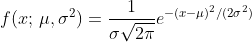
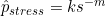

# Introduction

👥 We're introducing Samuel Orso and Aleksandr Shemendyuk with profiles detailing roles, hobbies, quotes, schedule, and pictures. It's a sneak peek into their life!

📊 Want to learn R Markdown syntax? We offer practical examples, discussing caching, sample creation, result comparison, and making histograms.

🧮 Finding equations difficult? We'll guide you on embedding equations seamlessly into your text, with plenty of examples.

🎨 We'll also explore fun text formatting techniques like creating buttons and colorful boxes.

📚 For a complete guide, check the final reference section – a must-have companion for this journey.

# Group Members

## Samuel ORSO

Lecturer in Data Science at UNIL,... 

My hobbies are...💡


> "Some mathematician, I believe, has said that true pleasure lies not in the discovery of truth, but in the search for it." -- Tolstoi

| Class | Time         |
|-------|--------------|
| PTDS  | 8h30 - 12h00 |

: Classes of Samuel ORSO

## Aleksandr SHEMENDYUK

Assistant in PTDS at UNIL, PhD student at Department of Actuarial Science


Sometimes I play chess ♟️, geoguessr 📍, or go for hikes 🏔️. And many other things, I've already lost count..


> "As far as you can avoid it, do not give grief to anyone. Never inflict your rage on another. If you hope for eternal rest, feel the pain yourself; but don't hurt others." -- Omar Khayyám

| Class  | Time          |
|--------|---------------|
| PTDS   | 8h30 - 12h00  |
| French | 12h30 - 14h00 |

: Classes of Aleksandr SHEMENDYUK

# R Markdown Syntax

## Cache example

Example of a situation where the `cache = T` leads to incorrect calculations:

```{r test, cache = T}
set.seed(123)
randomNumber <- rnorm(1)
randomNumber
```

This chunk will store a randomly generated number. However, because we set `cache = T`, when we rerun the chunk, the number won't change as it will be retrieving the number from the cache.

```{r}
randomNumber
```

In the chunk above, if we need to get a different number, we will get the same number every time we run it because we used `cache = T` in the first chunk. This might not be beneficial especially in situations where we require different outputs every time we run the code.

## Random sample

```{r}
set.seed(123)
# Generate 2000 random samples
lambda <- 2
y <- rpois(2000, lambda)

# Compute empirical mean and variance
y_mean <- mean(y)
y_var <- var(y)

# Theoretical mean and variance of a Poisson distribution
theoretical_mean <- 2
theoretical_variance <- 2

# Compare
print(paste("Empirical mean: ", y_mean))
print(paste("Theoretical mean: ", theoretical_mean))

print(paste("Empirical variance: ", y_var))
print(paste("Theoretical variance: ", theoretical_variance))
```

The empirical mean and variance should be close to the theoretical value ($\lambda = 2$) but might not match precisely. This is because of the randomness inherent in the simulation. With larger sample sizes, the empirical values should get closer to the theoretical values due to the Law of Large Numbers.

```{r, echo=FALSE}
results <- tibble::tibble(
  Measure = c("Mean", "Variance"),
  sample = c(y_mean, y_var),
  Theoretical = c(theoretical_mean, theoretical_variance)
) |> 
  dplyr::mutate("Absolute difference" = abs(Theoretical - sample)) |> 
  dplyr::rename("Sample estimate" = sample)

results |> 
  kableExtra::kbl(
    digits = 3,
    caption = paste0("Difference between the theoretical and observed values for lambda = ", lambda, ".")
  ) |> 
  kableExtra::kable_styling(
    position = "left",
    full_width = F
  )
```

To display the histogram of $y$, one would use the following command:

```{r hist_x, fig.cap="Historgram of y with 10 bins"}
hist(y, breaks = 10, xlab = "Data values", ylab = "Frequency")
```

adding as an option to this chunk the option `fig.cap="Historgram of y with 10 bins"` to display the caption to this figure. Here, we do not observe the accurate shape of the Poisson distribution with $\lambda = 2$, which should be more centred around the value of 2.

```{r hist_x_200, fig.cap="Historgram of y with 50 bins"}
hist(y, breaks = 50, xlab = "Data values", ylab = "Frequency")
```

Increasing the number of bins to 50 results in a more granular view of the data distribution. However, it could also lead to overfitting where too much noise is mistaken for an actual pattern. It's important to choose an appropriate number of bins to accurately convey the distribution of the data in a histogram.

## Equations

Include the following equation 

`\[ f(x;\, \mu, \sigma^2) = \frac{1}{\sigma\sqrt{2\pi}} e^{-(x-\mu)^2 / (2\sigma ^2)} \]`

This formula represents the Probability Density Function of a Normal Distribution where $\mu$ is the mean and $\sigma^2$ is the variance.

Include the following in-line equation: 

`$ \hat{p}_{stress} =k s^{-m}$`

This is a typical Stress-Life equation in material science, where $\hat{p}_{stress}$ represents the predicted stress, $s$ is the life of the material, and $k$ and $m$ are material constants.

On how to include references in Markdown, see [the guide](https://bookdown.org/yihui/rmarkdown-cookbook/bibliography.html).

As shown in @choi2023localization, the singular integral representation of the fractional Laplacian is defined as

$$
(-\Delta)^{\frac{\alpha}{2}} u(x)=c(d, \alpha) \text { p.v. } \int_{\mathbb{R}^d} \frac{u(x)-u(y)}{|x-y|^{d+\alpha}} d y:=\frac{2^\alpha \Gamma\left(\frac{\alpha}{2}+\frac{d}{2}\right)}{\pi^{\frac{d}{2}}\left|\Gamma\left(-\frac{\alpha}{2}\right)\right|} \text { p.v. } \int_{\mathbb{R}^d} \frac{u(x)-u(y)}{|x-y|^{d+\alpha}} d y .
$$

`\[ (-\Delta)^{\frac{\alpha}{2}} u(x)=c(d, \alpha) \text { p.v. } \int_{\mathbb{R}^d} \frac{u(x)-u(y)}{|x-y|^{d+\alpha}} d y:=\frac{2^\alpha \Gamma\left(\frac{\alpha}{2}+\frac{d}{2}\right)}{\pi^{\frac{d}{2}}\left|\Gamma\left(-\frac{\alpha}{2}\right)\right|} \text { p.v. } \int_{\mathbb{R}^d} \frac{u(x)-u(y)}{|x-y|^{d+\alpha}} d y . \]`

## Text

`<span style="color:blue">"The only thing that is constant is change.", Heraclitus.</span>`

["The only thing that is constant is change.", Heraclitus.]{style="color:blue"}

## Button

`<button data-toggle="collapse" data-target="#demo">Show/Hide Answer</button> <div id="demo" class="collapse"> This is the solution to the problem. </div>`

<button data-toggle="collapse" data-target="#demo">

Show/Hide Answer

</button>

::: {#demo .collapse}
This is the solution to the problem.
:::

## Color box

`<div style="background-color: #F5F5DC; padding: 10px; border: 1px solid black;"> "Learning never exhausts the mind." - Leonardo da Vinci </div>`

::: {style="background-color: #F5F5DC; padding: 10px; border: 1px solid black;"}
"Learning never exhausts the mind." - Leonardo da Vinci
:::

# References

<div id="refs"></div>
